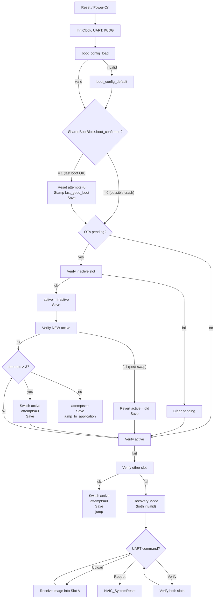
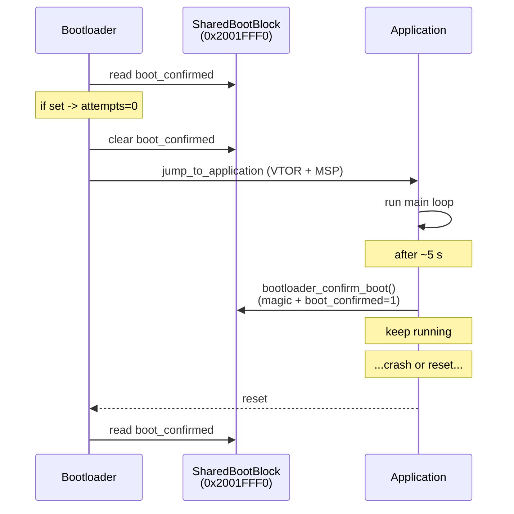

# Architecture

This document describes the bootloader's static structure (memory layout,
flash partitioning, vector-table alignment) and dynamic behaviour (the boot
state machine, the application-to-bootloader handoff via SharedBootBlock).

## Memory layout

```
0x08000000  Bootloader (64 KB)              sectors 0-3
0x08010000  BootConfig (4 KB used in sector 4)
0x08011000  Slot A (460 KB)                 [header 512B][app payload]
0x08084000  Slot B (460 KB)                 [header 512B][app payload]
0x080F7000  end of used flash

0x20000000  SRAM start (128 KB contiguous; CCM 64 KB lives at 0x10000000)
0x2001FFF0  SharedBootBlock (16 B, NOLOAD, not zeroed by startup)
0x2001FFFC  RAM end
```

The single source of truth for these addresses is
[`common/memory_map.h`](../common/memory_map.h), which uses `_Static_assert`
to verify that:

- the bootloader, config, and both slots do not overlap,
- both slots fit inside flash,
- the SharedBootBlock occupies exactly the top 16 B of SRAM,
- the application vector table inside each slot is 512-byte aligned (see
  next section).

## Firmware header and VTOR alignment

Each slot starts with a 512-byte `FirmwareHeader_t`
([`common/firmware_format.h`](../common/firmware_format.h)):

```
offset  size   field
------  ----   --------------------------------
   0     4     magic        = 0xDEADBEEF
   4     4     version      = 0xMMmmpp (semver)
   8     4     image_size   bytes of payload (excludes this header)
  12     4     timestamp    Unix seconds at signing time
  16     4     crc32        CRC32 of payload
  20    64     signature    ECDSA-P256 r||s big-endian
  84   428     reserved     pad to 512 B
```

The header is **deliberately 512 bytes** (not the 144 in the spec literal)
to satisfy ARM Cortex-M4 `SCB->VTOR` alignment. STM32F407 has 82 IRQs plus
16 system handlers = 98 vectors, which requires the next power-of-two
alignment of 512 bytes. With a 144-byte header the application's vector
table at `slot_addr + 144` would be misaligned, and `SCB->VTOR = app_addr`
would silently corrupt vectoring.

Verification:

| slot   | address              | offset from flash base | / 512  |
| ------ | -------------------- | ---------------------- | ------ |
| Slot A app entry | `0x08011200` | `0x11200 = 70144` | 137 |
| Slot B app entry | `0x08084200` | `0x84200 = 540672` | 1057 |

Both are exact multiples of 512. The compile-time asserts in
`common/memory_map.h` make this a build-time error if the layout drifts.

The signing convention is: the SHA-256 input is
`[header_with_signature_field_zeroed || payload]`. This means signer and
verifier hash the same bytes - the verifier doesn't need to extract or
copy the header.

## Boot state machine

The state machine runs in `bootloader/src/main.c`. Four correctness fixes
are baked in:

1. **Application-confirmation check** runs immediately after loading
   config: if `SHARED_BOOT_BLOCK.boot_confirmed` is set, attempts is reset
   to 0 and `last_good_boot` is stamped. The flag is then **cleared** so a
   stale value cannot survive across cycles.
2. **OTA-pending swap with post-swap re-verify**: after committing the
   swap, the new active slot is verified again. On failure, the swap is
   reverted (active slot reverted to the previous value) so we don't end
   up booting an image that just verified-then-failed-to-verify.
3. **Reset boot_attempts after slot switch**: when `boot_attempts > 3`
   triggers a slot switch, attempts is reset to 0 and persisted **before**
   re-entering verify-active. Without this the next pass would still see
   attempts > 3 and ping-pong slots forever within one boot cycle.
4. **Hard iteration cap (`MAX_SWAP_RETRIES = 4`)** as defense-in-depth in
   case any future logic regression breaks the bounded-iteration property.



## Application-to-bootloader handoff



If the application crashes before calling `bootloader_confirm_boot()`, the
flag stays at 0 and the bootloader treats it as a failed boot on the next
power-on. Three consecutive failed boots trigger a slot switch.

## Delta OTA (HPatchLite)

Differential updates use opcode **`START_DELTA`**: the patch blob is written to the **tail**
of the inactive slot (`expected_new_total + patch_total <= SLOT_SIZE`), then HPatchLite
reconstructs the signed image at the slot base before the usual ECDSA verification.
See [`docs/update_protocol.md`](update_protocol.md) and [`bootloader/src/delta_patch.c`](../bootloader/src/delta_patch.c).

## Memory layout — config storage caveat (real hardware)

On real STM32F407, sector 4 (`0x08010000`–`0x0801FFFF`) is a single 64 KB
erase unit. The 4 KB BootConfig region cannot be erased independently of
the 60 KB that follow. For QEMU's flash model this is glossed over (each
write is direct memory). For real silicon, two acceptable approaches are:

1. **Treat the whole sector 4 as the config region** (waste 60 KB, but
   the layout matches the spec).
2. **Ping-pong between sectors 4 and 5** (using sector 5 as the
   alternate; total cost 64 + 128 KB), which gives genuine atomic-update
   semantics: write the new record to the spare sector, erase the old.

Option 2 is recommended for production; option 1 is what the current code
uses, and is still correct because the CRC-protected torn-write recovery
ensures we never boot from a half-written record.

## QEMU caveat — flash is ROM, with a SRAM-backed shadow

QEMU 11.x's `netduino2` machine (the closest Cortex-M3 board with a 1 MB
flash and an `STM32F2`-style USART, used here as a stand-in for the
`STM32F407`) initialises the on-chip flash via `memory_region_init_rom`.
That makes the entire `0x08000000`-based flash window read-only at the
QEMU bus level: the `-kernel` image is loaded once and stays put, but
**every CPU store to a flash address is silently dropped** (no fault, no
write, the next read returns the original value). This is true even with
`-device loader,addr=0x08000000,file=...`.

A bootloader project whose primary value-prop is "we exercise the
config-save / OTA-program / verify-and-rollback paths on every test
run" is therefore unrunnable on QEMU as-is. Two options:

1. Patch + rebuild QEMU to use `memory_region_init_ram` for the flash.
   Faithful to silicon, but ships a forked toolchain.
2. Keep stock QEMU and shim a writable shadow inside the firmware
   under a compile-time flag.

We chose option 2. The QEMU build (`BUILD=qemu`, which sets
`-DQEMU_FLASH_SIM=1`) maintains a SRAM-backed shadow of the writable
flash regions in the bootloader's RAM, transparent to all callers.
Specifically:

- A struct `qemu_flash_shadow_t` lives in a NOLOAD linker section
  `.flash_shadow` at `0x2000E000` (just below the SharedBootBlock).
  The struct mirrors the boot config (4 KB) and the first 32 KB of
  Slot A and Slot B - more than enough for the demo image and any
  realistic test image. The full 460 KB slot is not shadowed because
  it would not fit in 128 KB of SRAM.
- A `QEMU_SHADOW_MAGIC` cookie at the head of the struct distinguishes
  a cold boot (random/zero RAM, fresh init from ROM) from a soft reset
  via `bootloader_system_reset()` (NVIC AIRCR), where the shadow is
  preserved by the NOLOAD section so post-OTA re-verify-after-reset
  works.
- `flash_program_word()`, `flash_program_bytes()`, `flash_erase_*()`
  write to the shadow only.
- `flash_read()` and a new `flash_get_ptr()` helper transparently
  serve from the shadow when the address falls in a shadowed window.
  Code that needs to dereference a `FirmwareHeader_t*` into a slot
  (`crypto.c` does this) goes through `flash_get_ptr()`, and the
  CRC32 / SHA-256 streamers in `crypto.c` go through `flash_read()`
  in 1 KB chunks so they never depend on a base pointer that might
  straddle the shadow / ROM boundary.

Because we cannot redirect CPU instruction fetches, the *final* step
of the OTA flow on QEMU - the bootloader's `bx` into the new app's
reset handler at `slot_addr + 0x200` - still pulls instructions from
the original ROM image. The recovery-OTA test
(`tests/test_recovery_ota.py`) is honest about this: it asserts up to
and including `INFO: jumping to slot B` and stops there. On real
silicon (Renode `stm32f4_discovery`, or physical STM32F4) the entire
chain runs end-to-end with no shadow needed. The HW build
(`BUILD=hw`, no `QEMU_FLASH_SIM`) drops `g_qemu_flash_shadow`
entirely; the `.flash_shadow` linker section is empty and the SRAM
region from `0x2000E000` upward is unused (cheap; the real bootloader
never needs more than ~10 KB of SRAM anyway).
