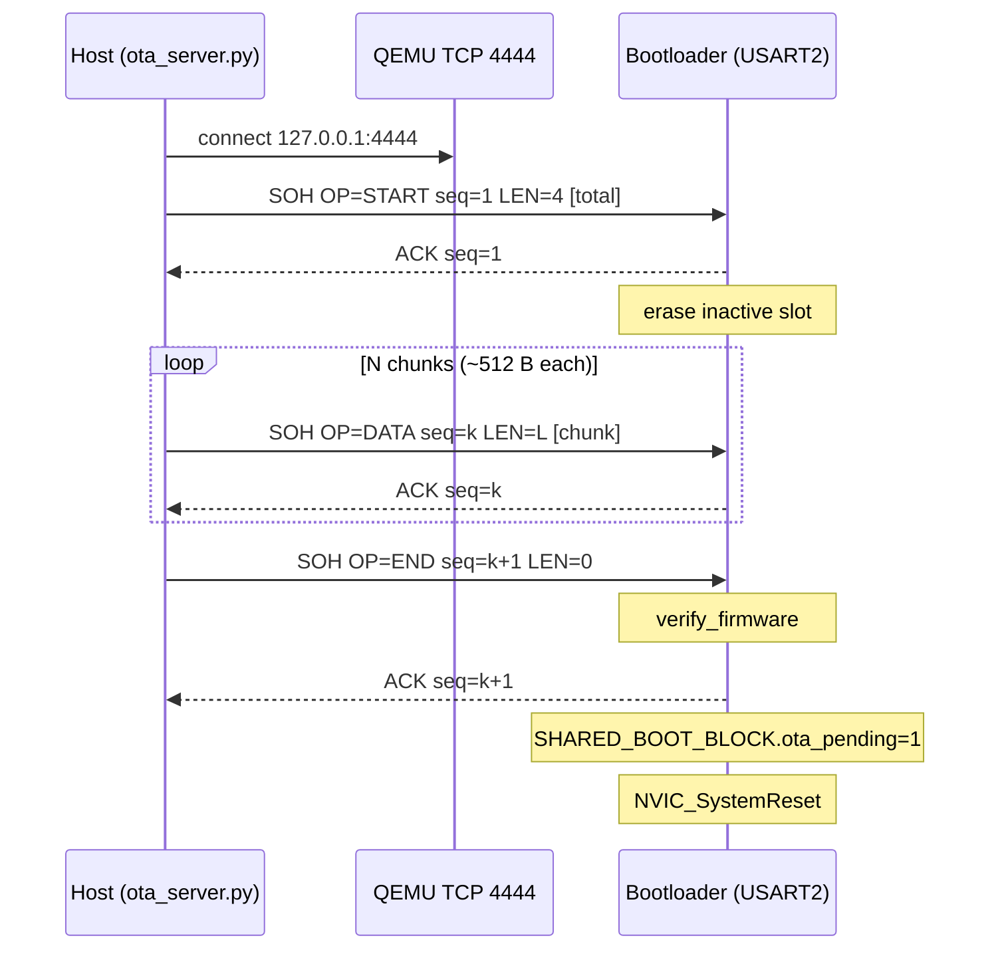

# OTA Update Protocol

**Protocol revision:** v2 — adds `START_DELTA` (0x24) for HPatchLite differential
updates alongside full-image `START` (0x21). v1-only hosts keep using `START` only.

The bootloader's OTA receiver speaks a small framed protocol over the OTA
UART (USART2). In the QEMU build that UART is bridged to TCP port 4444 via
`-serial tcp:127.0.0.1:4444,server,nowait`; on real hardware it's a normal
115200 8N1 serial line.

The Python pusher
([`tools/ota_server.py`](../tools/ota_server.py)) speaks the same wire
format on either transport - a `--tcp` flag (default
`127.0.0.1:4444`) or a `--serial COMx` / `--serial /dev/ttyUSB0` flag.

## Wire format

All multi-byte fields are little-endian.

```
Frame:    [SOH=0x01][OP][SEQ(2)][LEN(2)][DATA(LEN)][CRC32(4)]
Response: [ACK=0x06 | NAK=0x15][SEQ(2)]
```

`CRC32` covers `OP || SEQ || LEN || DATA` (everything after `SOH` and
before the trailing CRC), IEEE 802.3 polynomial.

## Opcodes

| OP   | Name            | DATA contents |
| ---- | --------------- | ------------- |
| 0x21 | `START`         | `total_size` (u32 LE) of the full signed image |
| 0x24 | `START_DELTA`   | 40 bytes: `patch_total` (u32 LE), `expected_new_total` (u32 LE), `base_sha256` (32 bytes). See below. |
| 0x22 | `DATA`          | chunk appended at the running write offset (full image or patch tail) |
| 0x23 | `END`           | empty |
| 0x2F | `ABORT`         | empty |

### `START_DELTA` semantics

- **`patch_total`**: Byte length of the HPatchLite patch stream carried by subsequent `DATA` frames.
- **`expected_new_total`**: Byte length of the **reconstructed** signed firmware image (`FirmwareHeader_t` + payload) after applying the patch; must match the `newSize` field in the patch header and `crypto_verify_firmware()` on the inactive slot.
- **`base_sha256`**: SHA-256 of the **on-device** old image bytes: the first `sizeof(FirmwareHeader_t) + image_size` bytes of the **currently active** slot (same layout as on flash, including the populated signature field). The host computes this from the signed baseline image file via [`tools/delta_common.py`](../tools/delta_common.py).

**Inactive slot layout during delta:** The inactive slot is erased. Patch bytes are written to the **tail** — `[slot_base + SLOT_SIZE - patch_total, slot_base + SLOT_SIZE)` — so they do not overlap the reconstructed image written from `slot_base` upward during patch apply. Constraint enforced by the bootloader: `expected_new_total + patch_total <= SLOT_SIZE`.

The bootloader applies **`delta_apply_patch()`** (HPatchLite with **`hpi_compressType_no`** or **`hpi_compressType_tuz`** via vendored tinyuz), then runs the same **`crypto_verify_firmware()`** as full OTA. Patches are produced with [`tools/make_delta.py`](../tools/make_delta.py) (requires `hdiffi` on `PATH`; use `--compress tuz` for compressed patches).

## State machine (receiver)

**Full image (`START`)**

1. On `START`: pick the inactive slot, erase the range `[slot_addr, slot_addr + total_size)`, set `written = 0`. ACK.
2. `DATA` frames program `slot_addr + written`. ACK.
3. On `END`, `crypto_verify_firmware(inactive)`; on success, set `ota_pending` and reset.

**Delta (`START_DELTA`)**

1. On `START_DELTA`: verify `base_sha256` against the active slot; pick inactive slot; erase the **entire** inactive slot; set `patch_tail = slot_addr + SLOT_SIZE - patch_total`, `written = 0`. ACK.
2. `DATA` frames program `patch_tail + written` (patch bytes only). ACK.
3. On `END`, run HPatchLite apply (old = active slot, diff = tail of inactive, new = from `slot_addr`), then `crypto_verify_firmware(inactive)`; on success, set `ota_pending` and reset.

**Common:** On any CRC mismatch, sequence error, or flash error, NAK; the host retransmits the same SEQ.

## Sequence diagram (happy path, QEMU TCP transport)



After the reset, the bootloader sees the pending flag and performs the
slot swap (with post-swap re-verify) per the boot state machine in
[architecture.md](architecture.md).

## Production transport: HTTP over Wi-Fi/Ethernet

For real-world IoT deployment, the simulation transport (TCP-bridged
UART) would be replaced by a TCP/IP stack (lwIP, NetX, etc.) and an
HTTP/HTTPS client. The bootloader's verification, dual-bank, and
rollback logic remain bit-for-bit identical; only the transport layer
differs:

| layer                     | simulation (this project)              | production                                                |
| ------------------------- | -------------------------------------- | --------------------------------------------------------- |
| transport                 | UART over TCP socket                   | HTTP/HTTPS over Wi-Fi/Ethernet                            |
| framing                   | SOH/OP/SEQ/LEN/DATA/CRC32              | HTTP chunked transfer + per-chunk CRC32                   |
| host tool                 | `ota_server.py`                        | cloud firmware server with versioning + delta updates     |
| auth (link-level)         | none (loopback)                        | TLS 1.3                                                    |
| auth (image-level)        | ECDSA-P256 over SHA-256 (this stays)   | same (image signing is independent of transport)          |
| binary footprint          | ~2 KB OTA client + UART driver         | ~40-50 KB lwIP + TLS                                      |

The 64 KB bootloader budget in this project would not fit lwIP + TLS
alongside the verifier; production firmware typically dedicates ~128 KB
or more to the secure-boot/OTA combo, and uses the larger
DFU/Rollback-aware MCUs (e.g. STM32U5, with on-die secure storage).

## Retry semantics

- Each frame is retransmitted up to `RETRIES_PER_FRAME = 5` times on
  NAK or response timeout.
- Inter-frame timeout: `RESPONSE_TIMEOUT_S = 2.0` s.
- The receiver tolerates up to 16 consecutive errors before giving up
  and returning to recovery mode.
- SEQ is a 16-bit field that wraps at `0xFFFF`. Maximum images (~512 KB
  with 512 B chunks) need ~1024 frames, well below the wrap point.
