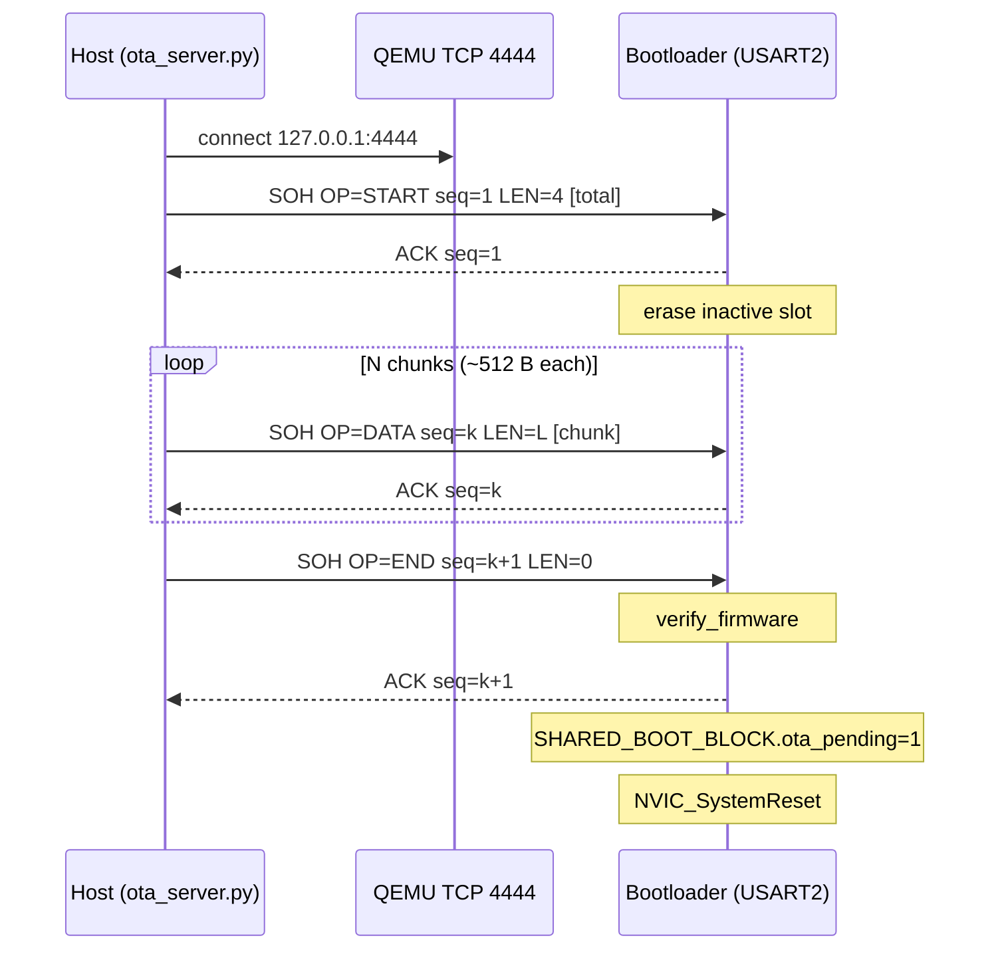

# OTA Update Protocol

The bootloader's OTA receiver speaks a small framed protocol over the OTA
UART (USART2). In the QEMU build that UART is bridged to TCP port 4444 via
`-serial tcp:127.0.0.1:4444,server,nowait`; on real hardware it's a normal
115200 8N1 serial line.

The Python pusher
([`tools/ota_server.py`](../tools/ota_server.py)) speaks the same wire
format on either transport - a `--tcp` flag (default
`127.0.0.1:4444`) or a `--serial COMx` / `--serial /dev/ttyUSB0` flag.

## Wire format

All multi-byte fields are little-endian.

```
Frame:    [SOH=0x01][OP][SEQ(2)][LEN(2)][DATA(LEN)][CRC32(4)]
Response: [ACK=0x06 | NAK=0x15][SEQ(2)]
```

`CRC32` covers `OP || SEQ || LEN || DATA` (everything after `SOH` and
before the trailing CRC), IEEE 802.3 polynomial.

## Opcodes

| OP   | Name      | DATA contents                           |
| ---- | --------- | --------------------------------------- |
| 0x21 | `START`   | `total_size` (u32 LE) of the signed image |
| 0x22 | `DATA`    | a chunk of bytes appended at the running offset |
| 0x23 | `END`     | empty                                   |
| 0x2F | `ABORT`   | empty                                   |

## State machine (receiver)

1. Wait for `START`.
   - On START: pick the inactive slot from `BootConfig.active_slot`,
     erase it, record `total_size` and reset `written = 0`. ACK.
2. Repeatedly accept `DATA` frames whose SEQ is the previously ACK'd
   SEQ + 1. Each frame is programmed to `slot_addr + written`. ACK.
3. On `END`, run `crypto_verify_firmware()` on the inactive slot; if it
   passes, set `SHARED_BOOT_BLOCK.ota_pending = 1`, ACK, and call
   `NVIC_SystemReset()`.
4. On any CRC mismatch, sequence error, or flash error, NAK; the host
   retransmits the same SEQ.

## Sequence diagram (happy path, QEMU TCP transport)



After the reset, the bootloader sees the pending flag and performs the
slot swap (with post-swap re-verify) per the boot state machine in
[architecture.md](architecture.md).

## Production transport: HTTP over Wi-Fi/Ethernet

For real-world IoT deployment, the simulation transport (TCP-bridged
UART) would be replaced by a TCP/IP stack (lwIP, NetX, etc.) and an
HTTP/HTTPS client. The bootloader's verification, dual-bank, and
rollback logic remain bit-for-bit identical; only the transport layer
differs:

| layer                     | simulation (this project)              | production                                                |
| ------------------------- | -------------------------------------- | --------------------------------------------------------- |
| transport                 | UART over TCP socket                   | HTTP/HTTPS over Wi-Fi/Ethernet                            |
| framing                   | SOH/OP/SEQ/LEN/DATA/CRC32              | HTTP chunked transfer + per-chunk CRC32                   |
| host tool                 | `ota_server.py`                        | cloud firmware server with versioning + delta updates     |
| auth (link-level)         | none (loopback)                        | TLS 1.3                                                    |
| auth (image-level)        | ECDSA-P256 over SHA-256 (this stays)   | same (image signing is independent of transport)          |
| binary footprint          | ~2 KB OTA client + UART driver         | ~40-50 KB lwIP + TLS                                      |

The 64 KB bootloader budget in this project would not fit lwIP + TLS
alongside the verifier; production firmware typically dedicates ~128 KB
or more to the secure-boot/OTA combo, and uses the larger
DFU/Rollback-aware MCUs (e.g. STM32U5, with on-die secure storage).

## Retry semantics

- Each frame is retransmitted up to `RETRIES_PER_FRAME = 5` times on
  NAK or response timeout.
- Inter-frame timeout: `RESPONSE_TIMEOUT_S = 2.0` s.
- The receiver tolerates up to 16 consecutive errors before giving up
  and returning to recovery mode.
- SEQ is a 16-bit field that wraps at `0xFFFF`. Maximum images (~512 KB
  with 512 B chunks) need ~1024 frames, well below the wrap point.
